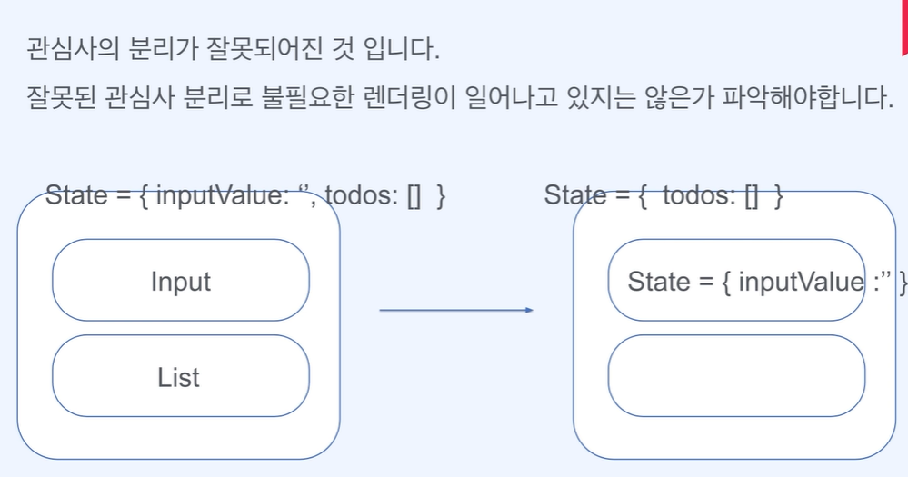

# ch1

## 02 최적화의 중요성 및 학습 내용

### 최적화란?

> 최적화를 한다는 것은 어플리케이션의 성능을 향상시키는 방법을 찾고 적용하는 것을 의미

> 더 빠른 로딩 시간, 더 나은 사용자 경험, 그리고 자원의 효과적인 사용을 목표로 함

* 왜 우리는 그간 최적화의 중요성을 못 느꼈는가?
    1. 개발 성능이 너무 좋아서
    2. 이미 거대해져버린 애플리케이션에 대한 부담
    3. 일이 너무 바빠서...(성능 최적화<기능 개발)

* 최적화는 왜 필요한가?
    * 개발 초기 단계에서 성능 최적화를 고려하고, 다양한 환경에서의 테스트를 실시하며, 꾸준히 성능을 모니터링하는 것이 중요
    * 이는 사용자 경험을 향상시키고, 시스템 확장성을 보장하며, 장기적으로 애플리케이션 유지 관리 비용 절감에 효과적

> SPA(single page application)
기존 multie page application과는 다르게 자바스크립트를 사용해서 페이지를 이동하는 것처럼 보여준다.
즉, 자바스크립트 양을 줄이는 것이 중요해짐

* 어떤 최적화를 학습하는지
    1. 동영상와 이미지 최적화
    2. 폰트 최적화
    3. 애니메이션 최적화
    4. SEO 최적화
    5. 번들 사이즈 줄이는 방법
    6. 초기 로딩속도 올리는 방법
    7. 대용량 리스트를 다루는 방법
    8. SSR 과 CSR을 함께 사용하여 성능을 올리는 방법

***************

## 03 리액트를 조금 더 리액트스럽게 사용하는 방법

최적화를 고민하기 전에 리액트 본질에 집중해볼 것

리액트의 주요 원칙과 철학을 이해하고 적용하여 개발해보자!

1. 리액트는 상태 값이 변경되면 화면을 갱신한다   

    ➡️ 리액트는 상태를 가진 컴포넌트와 하위 자식을 다시 그리기 때문에 상태값을 잘 배치하는 것이 중요       

    ➡️ 어떻게 하는 것이 잘 배치하는 것일지?

    

    > 관심사 분리가 잘못됨!!, 불필요한 렌더링 일어나고 있는지 파악할 것
    > 우리가 원하는 것은 완성된 input의 value이지, input의 value가 변하는 과정은 궁금하지 않음! 그렇기 때문에 input value를 전달하거나 서버로 요청하는 것이 옳게 된 관심사 분리

2. 정말 필요한 상태값인가?      

    ➡️ 개발에 불필요한 복잡도를 올리는 행위            

    ➡️ 불필요한 상태값일 경우, 단순 변수로 선언하거나, useMemo를 이용할 것

    

3. 리액트는 단방향 데이터 흐름을 가진다.

    ➡️ 리액트는 부모에서 자식으로만 데이터가 흐르는 단방향 데이터 흐름을 가짐

    ➡️ 형제끼리는 데이터 교환이 불가

    ➡️ 깊이가 너무 깊어진다면, 전역 상태관리자 도입을 고민