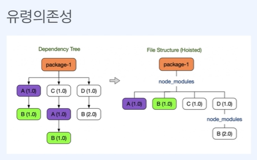
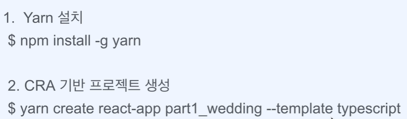
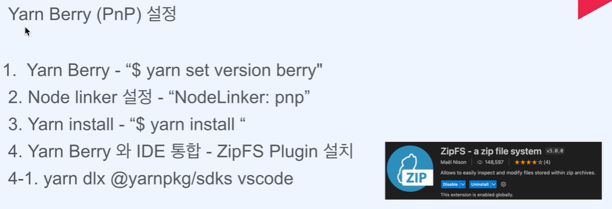

# ch1 오리엔테이션

## 02 유저 시나리오 및 최적화 포인트 소개

1. 프로젝트01-나만의 청첩장 만들기 프로젝트
    * 이미지, 동영상, 폰트 등의 정적 리소스 최적화
    * 불필요한 렌더링 줄이기
    * UX 경험 올리기(예상치 못한 에러 상황 대응)

2. 프로젝트02-카드사
    * 번들사이즈 다이어트
    * 효율적으로 폼 다루기
    * 유저가 지치 않는 UIUX

3. 프로젝트03-여행사이트
    * 첫 페이지 렌더링 빠르게 하는 방법
    * 대용량 리스트 다루는 방법
    * 애니메이션 최적화
    * SEO 최적화(검색엔진)

4. 프로젝트04-자산관리
    * 프로젝트 1-3에서 다뤘던 기법들 모두 적용
    * SSR 환경에서의 최적화 기법
    * 로그를 활용하여 문제점 찾기
    * UX 경험 올리기

# ch2 프로젝트 설정

## 01 프로젝트 생성 및 환경 설정

Boilerplate ➡️ Create React App + Typescript

Rules ➡️ ESLint + Prettier

Style ➡️ SCSS 

Package Manager ➡️ Yarn Berry(with. pnp)

> 왜 npm을 안 쓰는지?
- 무겁고 복잡한 node_modules
- 비효율적인 의존성 검색
- 비효율적인 설치(다른 버전의 패키지 중복 설치)
- 유령 의존성
    
- yarn berry는 node_modules를 생성하지 않기 때문에 폴더를 순회할 필요가 없음

> Plug 'n' play(PnP)
- 효율적인 의존성 검색
- 엄격한 의존성 관리
- CI 시간 단축

    

> Yarn Berry(PnP) 설정
    
1. node_modules 삭제하고
2. yarn set version berry
3. yarnrc 파일에서 nodeLinker: pnp 추가
4. yarn install

* pnp.cjs 에서 의존성 관리
## 02 프로젝트 생성 및 환경 설절

# ch3 프로젝트 실습 시작하기

## 01 Json-Server 소개 및 설정

## 02 Json-Server 활용하여 Rest API 만들기

